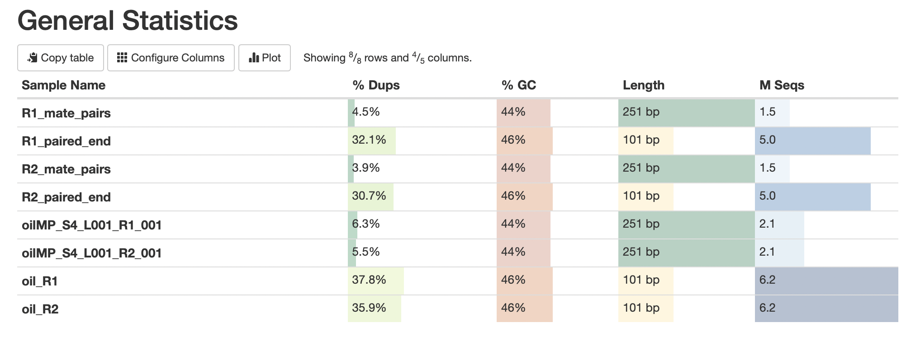
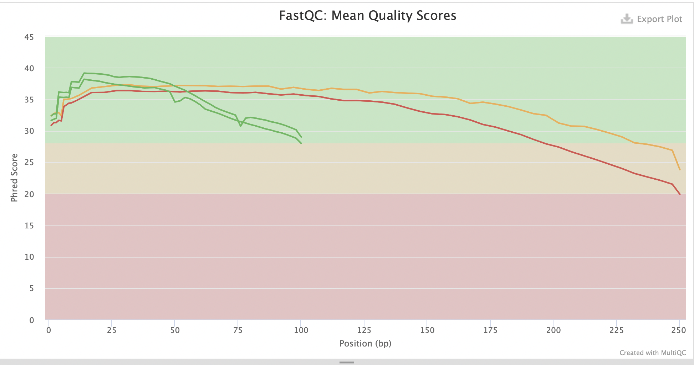
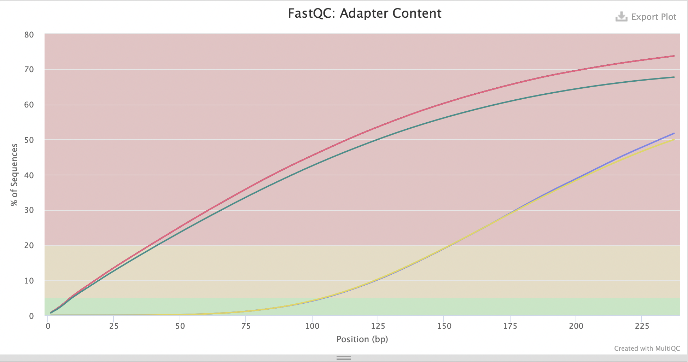
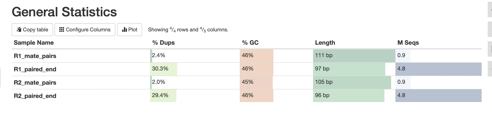
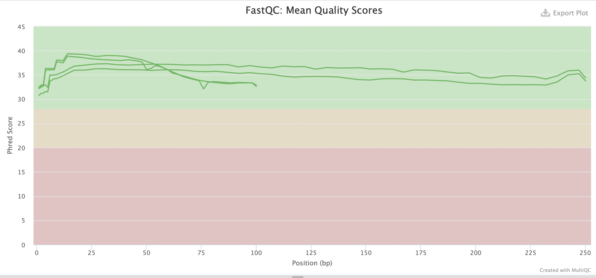
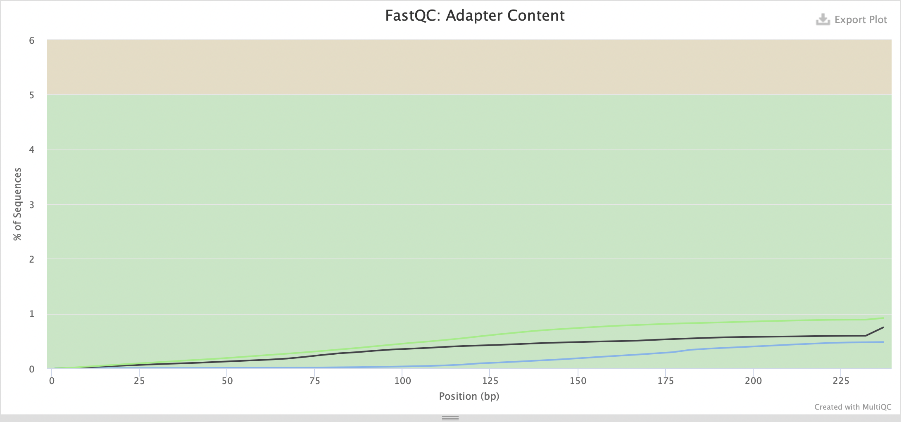

# hse21_hw1
### Создание ссылок на файлы
ln -s /usr/share/data-minor-bioinf/assembly/oilMP_S4_L001_R1_001.fastq

ln -s /usr/share/data-minor-bioinf/assembly/oilMP_S4_L001_R2_001.fastq

ln -s /usr/share/data-minor-bioinf/assembly/oil_R1.fastq

ln -s /usr/share/data-minor-bioinf/assembly/oil_R2.fastq

### Выбираем образец 1305(13 мая) и отбираем 5000000 случайных чтений pair-end и 1500000 чтений mate pair
seqtk sample -s1305 oil_R1.fastq 5000000 > R1_paired_end.fastq

seqtk sample -s1305 oil_R2.fastq 5000000 > R2_paired_end.fastq

seqtk sample -s1305 oilMP_S4_L001_R1_001.fastq 1500000 > R1_mate_pairs.fastq

seqtk sample -s1305 oilMP_S4_L001_R2_001.fastq 1500000 > R2_mate_pairs.fastq

### Проводим оценку качества исходных чтений с помощью fastQC и multiQC

mkdir fastqc

ls *.fastq | xargs -P 4 -tI{} fastqc -o fastqc {}

mkdir multiqc

multiqc -o multiqc fastqc

### Статистика для первоначальных чтений

### Используя platanus_trim и platanus_internal_trim подрезаем чтения по качеству и удаляем праймеры

platanus_trim R1_paired_end.fastq R2_paired_end.fastq 

platanus_internal_trim R1_mate_pairs.fastq R2_mate_pairs.fastq

### Проводим оценку качества новых чтений c помощью программ fastQC и multiQС

mkdir trimmed_fastqc 

ls *trimmed | xargs -P 4 -tI{} fastqc -o trimmed_fastqc {} 

mkdir trimmed_multiqc 

multiqc -o trimmed_multiqc trimmed_fastqc

### Удаляем исходники

rm R1_paired_end.fastq

rm R2_paired_end.fastq

rm R1_mate_pairs.fastq

rm R2_mate_pairs.fastq

### Общая статистика для новых чтений

### Сравнив результаты для изначальных и новых чтений, делаем выводы:

1) Mean quality scores после удаления праймеров переместился в зеленую зону 

2) Уменьшились длины последовательностей 

3) Уменьшился процент содержания адаптеров

### Собираем контиги и скаффолды

time platanus assemble -o Poil -t 2 -m 28 -f R1_paired_end.fastq.trimmed R2_paired_end.fastq.trimmed 2> assemble.log

time platanus scaffold -o Poil -t 2 -c Poil_contig.fa -IP1 R1_paired_end.fastq.trimmed R2_paired_end.fastq.trimmed -OP2 R1_mate_pairs.fastq.int_trimmed R2_mate_pairs.fastq.int_trimmed 2> scaffold.log

### Код на python для анализа контигов

import numpy as np
def analysis_c(contig):
    counter = 0
    length = 0
    array = []
    for row in contig:
        if row[0] == '>':
            counter += 1
            length += int(row.split('_')[1][3:])
            array.append(int(row.split('_')[1][3:]))
    array = np.asarray(array)
    array = np.sort(array)[::-1]
    value = np.sum(array) / 2
    n50 = array[np.cumsum(array) >= value][0]
    
    print('Общее количество контигов: ', counter)
    print('Суммарная длина контигов: ', length)
    print('Длина самого длинного контига: ', max(array))
    print('N50: ', n50)
   
### Код на python для анализа скаффолдов

import numpy as np
def analysis_s(scaffold):
    counter = 0
    length = 0
    array = []
    for row in scaffold:
        if row[0] == '>':
            counter += 1
            length += int(row.split('_')[1][3:])
            array.append(int(row.split('_')[1][3:]))
    array = np.asarray(array)
    array = np.sort(array)[::-1]
    value = np.sum(array) / 2
    n50 = array[np.cumsum(array) >= value][0]
    
    print('Общее количество скаффолдов: ', counter)
    print('Суммарная длина скаффолдов: ', length)
    print('Длина самого длинного скаффолда: ', max(array))
    print('N50: ', n50)
    
### Анализ контигов

contig_file = open('Poil_contig.fa', 'r')
contig = contig_file.readlines()
analysis_c(contig)

### Результат

Общее количество контигов:  626
Суммарная длина контигов:  3926502
Длина самого длинного контига:  179307
N50:  54903

### Анализ скаффолдов

scaffold_file = open('Poil_scaffold.fa', 'r')
scaffold = scaffold_file.readlines()
analysis_s(scaffold)

### Результат

Общее количество скаффолдов:  69
Суммарная длина скаффолдов:  3873334
Длина самого длинного скаффолда:  3831631
N50:  3831631

### Поиск наибольшего скаффолда

for line in scaffold:
    if int(line.split('_')[1][3:]) == 3831631:
        print(line)
        break

### Записываем в файл

echo scaffold1_len3831631_cov231 > max_scaffold.txt

seqtk subseq Poil_scaffold.fa max_scaffold.txt > max_scaffold.fa
